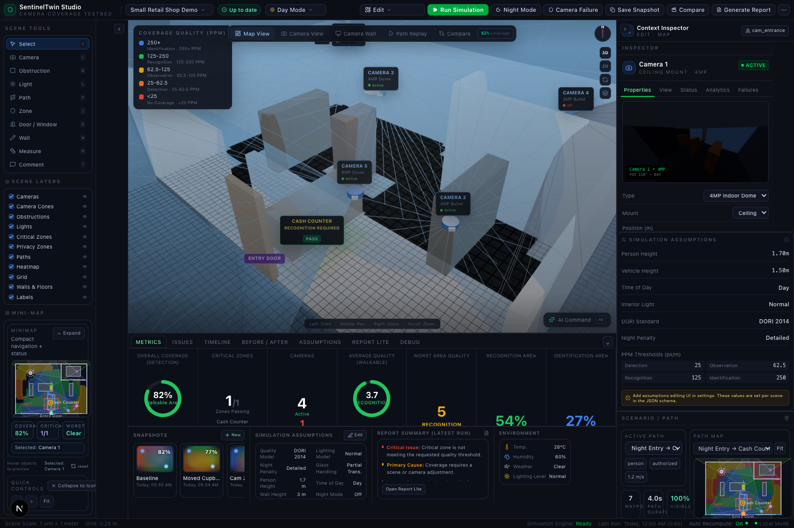
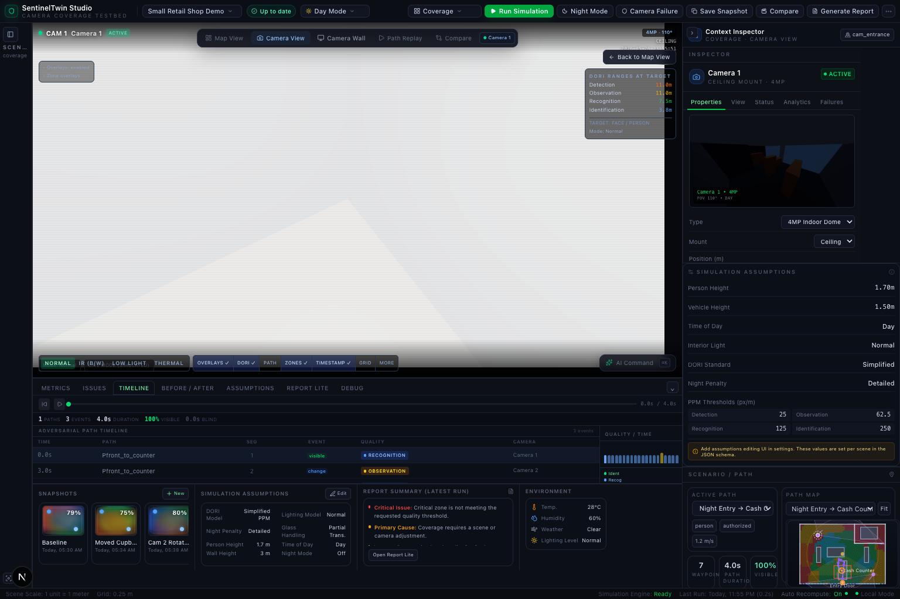
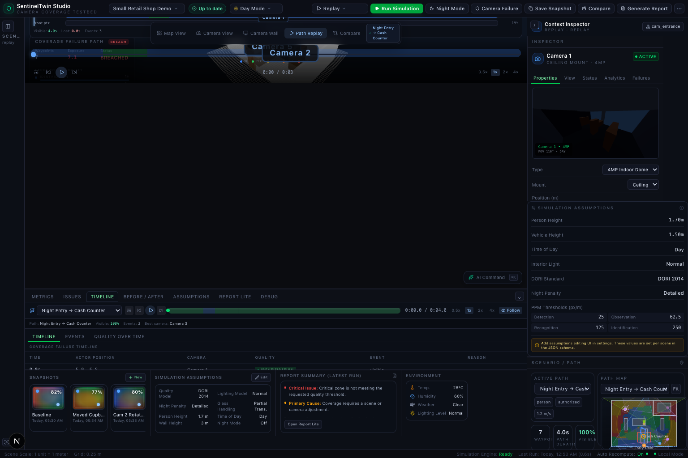
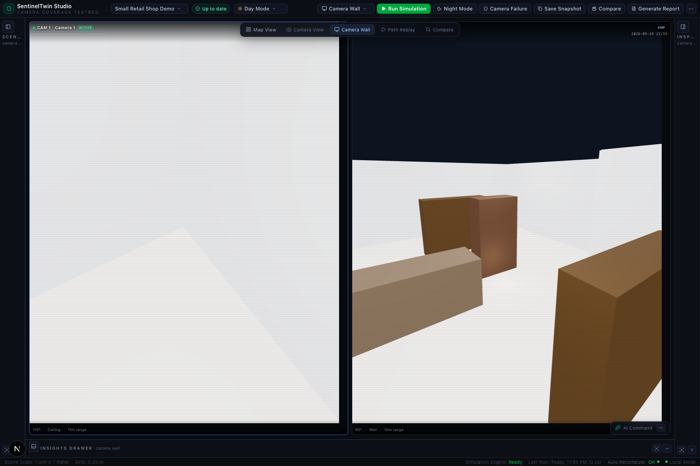
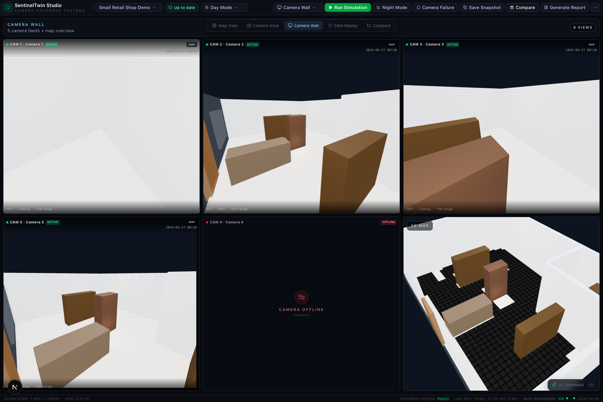
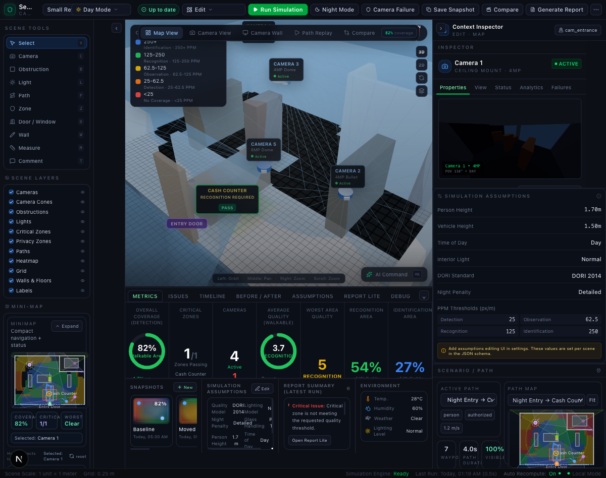
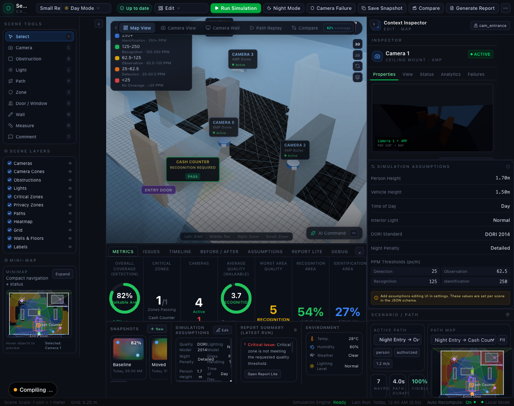
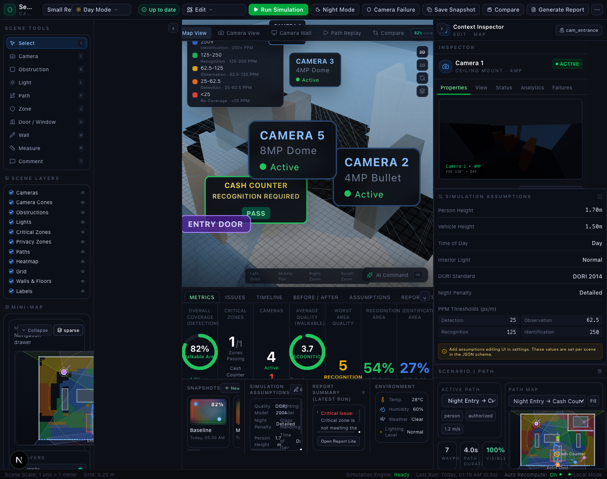

# SentinelTwin

AI-native physical security digital twin for authorized incident replay, coverage failure analysis, hardening recommendations, and evidence-backed reporting.

SentinelTwin is the full product, not a camera studio. The studio/editor is one major subsystem inside a broader security intelligence platform that includes intake, audit, replay, compare, governance, sensor evidence, reporting, deployment, and extensibility.

## Current Product Frame

The current repository already includes a coherent security platform spine:

- intake flows for scan, floor plan, JSON import, and AI draft
- map, camera, wall, replay, compare, report, and governance surfaces
- deterministic coverage and evidence computation
- sensor and live metadata ingest seams
- local-first workspace persistence and archive/recovery flows

The visuals below show the current shape of the experience. The product should be read as an evolving full app, not as a versioned MVP series.

## Selected Screens

### Core studio views

<table>
  <tr>
    <td></td>
    <td></td>
  </tr>
  <tr>
    <td></td>
    <td></td>
  </tr>
  <tr>
    <td></td>
    <td></td>
  </tr>
</table>

### Design direction

<table>
  <tr>
    <td></td>
    <td></td>
  </tr>
</table>

## What is next

The next work should continue the full-app buildout: complete missing surfaces, remove stub/placeholder claims, harden deployment and governance, and keep the UI honest about what is implemented versus preview or planned.

## Repo structure

- `apps/studio` - main studio app
- `Docs/` - architecture, decisions, exploration, and progress notes

## Notes

This README is intentionally high-level for the repo entry point. The detailed architecture and working notes live in `Docs/`.
