# SentinelTwin UI Design Pack — Screens, Components, Briefs, and Implementation Notes

This document collects every UI image generated in the SentinelTwin design pass so agents can choose the relevant screen/component reference and map it cleanly to implementation.

## How agents should use this pack

- Treat **Primary target** images as implementation references.
- Treat **Deprecated / rejected** images as negative references or historical context only.
- Treat **Design System** boards as canonical cross-component rules.
- Do not remove working repo functionality to match a mockup. Evolve existing `StudioShell`, `DockLayout`, mode routing, `WorkspaceCanvas`, `MiniMap`, `PathMap`, and panels toward the targets.

## Immediate implementation priorities

1. Replace the current form-like root page with `StudioDashboardHome_CurrentWorkspacePreview_RiskStatusPanel.png`.
2. Polish the existing Coverage, Camera View, Camera Wall, Path Replay, and Compare modes against their target references.
3. Canonicalize `DesignSystem_MapLayerVisualLanguage_CanonicalTokens.png` into design tokens and docs.
4. Use MiniMap/PathMap component boards to finish edge states and interactions.

## Image inventory

| # | Save-as filename | Status | Screen / Component | Purpose |
|---:|---|---|---|---|
| 1 | `Deprecated_InitialAIStyleDashboard_Rejected.png` | Deprecated / reference only | Initial AI SaaS Dashboard — rejected direction | Early visual exploration that looked too much like a generic AI SaaS dashboard. Keep only as a negative reference. |
| 2 | `Deprecated_ProjectConsole_NotV01Primary.png` | Deprecated as first screen / reference for later project console | Project Console — useful but not V0.1 primary | A more professional project console, but still not the right V0.1 first screen because Camera Studio should open directly into the testbed. |
| 3 | `CameraStudioWorkspace_MainCoverage_EarlyTarget.png` | Reference / superseded by later full-suite coverage designs | Camera Testbed Studio — early main workspace target | First correct direction: open directly into the camera testbed with Small Retail Shop loaded. |
| 4 | `FullCameraSuiteCoverageMode_metrics_Camera1Inspector_Concept.png` | Reference / coverage mode target | Full Camera Suite Coverage Mode — broad concept | Expanded camera suite coverage mode with many controls and panels visible. |
| 5 | `FullCameraSuiteCoverageMode_metrics_Camera1Inspector.png` | Primary target for Coverage Mode | Full Camera Suite Coverage Mode — final main coverage target | Primary V0.1 Camera Studio screen: coverage heatmap, DORI quality, camera cones, path, snapshots, assumptions, report summary. |
| 6 | `CoverageMode_Metrics_Camera1Inspector.png` | Primary target variant / cleaner coverage mode | Coverage Mode — cleaner V0.1 primary workspace | Cleaner V0.1 first workspace focused on coverage, metrics, and camera editing. |
| 7 | `CameraViewMode_TimelinePathReplay_Camera1InspectorViewtab.png` | Primary target for Camera View polish | Camera View Mode | Shows the simulated feed from a selected camera with DORI overlays, target info, and replay context. |
| 8 | `CameraWallMode_Timeline_Camera1InspectorViewTab.png` | Primary target for Camera Wall polish | Camera Wall Mode | Shows multiple simulated camera feeds at once to identify which cameras see the actor and which fail. |
| 9 | `PathReplayMode_Timeline_Camera1Inspector.png` | Primary target for Path Replay polish | Path Replay Mode | Detailed route visibility analysis over time: actor path, lost/visible moments, per-camera quality, and recommendations. |
| 10 | `CompareMode_BeforeAfter_Camera1InspectorViewTab.png` | Primary target for Compare polish | Compare / Before-After Mode | Compares baseline vs proposed fix with verified coverage, recognition, critical-zone, and path deltas. |
| 11 | `MiniMapComponent_DesignBoard_InitialStates.png` | Reference / superseded by refined MiniMap board | MiniMap — initial design board | Explores MiniMap role, purpose, compact size, hover preview and pinned preview. |
| 12 | `MiniMapComponent_States_CollapsedCompactExpanded.png` | Primary MiniMap state reference | MiniMap — collapsed, compact, expanded states | Defines MiniMap states: icon rail, compact always-visible map, expanded navigation panel, and hover behavior. |
| 13 | `MiniMapComponent_ExpandedHoverState_DrawerNavigation.png` | Primary expanded MiniMap reference | MiniMap — expanded / hover state | Defines expanded MiniMap as active navigation and selection tool. |
| 14 | `PathMapComponent_ScenarioPathPanel_RouteSummaryState.png` | Primary PathMap summary reference | PathMap — scenario/path panel state | Defines PathMap as compact route summary showing selected path, quality, cameras, lost/visible points and target zone. |
| 15 | `PathMapComponent_ReplayState_LiveActorVisibility.png` | Primary PathMap replay reference | PathMap — replay state | Defines how PathMap scrubs with time during replay and shows current visibility/DORI/camera state. |
| 16 | `DesignSystem_MapLayerVisualLanguage_CanonicalTokens.png` | Critical design-system reference | Map Layer Visual Language | Canonical colors, symbols, fills, line styles and interaction states for all map/canvas/timeline/report surfaces. |
| 17 | `DesignSystem_MapInteractionStates_MiniMapPathMapWireframes.png` | Reference / superseded by refined board | Map interaction states — first wireframe board | Early state matrix for hover/click/zoom/empty/multipath/special geometry/privacy cases. |
| 18 | `DesignSystem_MapInteractionStates_RefinedWireframeBoard.png` | Primary interaction-state reference | Map interaction states — refined board | Defines global interaction behavior for MiniMap/PathMap hover, click, selection, zoom, missing-state, multi-path, geometry, privacy violation, and transitions. |
| 19 | `StudioDashboardHome_CurrentWorkspacePreview_RiskStatusPanel.png` | Immediate root replacement target | Studio Dashboard Home — current workspace preview | Replaces the form-like root page with a studio dashboard focused on the currently loaded workspace. |
| 20 | `PlatformHome_CommandCenter_RecentWorkspaceRiskOverview.png` | Future full-app root concept | Platform Home — command center for full product | Full finished-product homepage across projects, sites, scenes, reports, issues, recommendations and activity. |
| 21 | `CurrentRepoRootLauncher_FormProblem.png` | Current problem / replace | Current repo root launcher — problem reference | Screenshot of current root page that looks like a form/checklist instead of a studio dashboard. |

---

## 1. Initial AI SaaS Dashboard — rejected direction

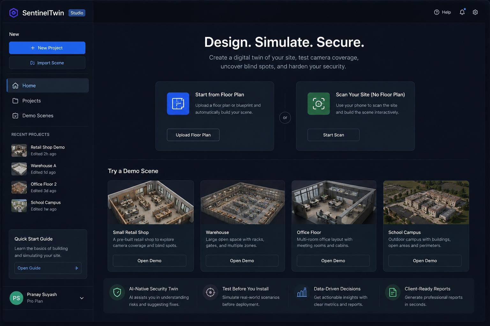

| Field | Value |
|---|---|
| Status | Deprecated / reference only |
| Screen | SentinelTwin Studio |
| Workspace preset | Launcher / early dashboard concept |
| Subscreen | AI SaaS style home |
| Active tab/panel | N/A |
| Selected component | New Project / Demo Cards |
| Dock state | Fixed sidebar + marketing dashboard |
| Purpose | Early visual exploration that looked too much like a generic AI SaaS dashboard. Keep only as a negative reference. |
| Save as | `Deprecated_InitialAIStyleDashboard_Rejected.png` |
| Feel target | Rejected. Avoid this tone. |

### What is correct in the image

- Dark theme and basic product areas existed.
- Showed demo scenes and recent projects.

### What feels wrong / avoid

- Too AI-startup/landing-page-like.
- Large marketing hero copy dominated the page.
- Fake photoreal cards and generic feature badges made the product feel less serious.

### What must stay / implementation contract

- Do not use this as implementation target.

---

## 2. Project Console — useful but not V0.1 primary

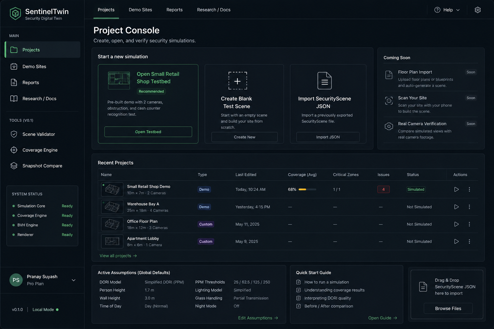

| Field | Value |
|---|---|
| Status | Deprecated as first screen / reference for later project console |
| Screen | SentinelTwin Studio |
| Workspace preset | Project Console |
| Subscreen | Project selection dashboard |
| Active tab/panel | Recent Projects |
| Selected component | Open Small Retail Shop Testbed |
| Dock state | Left project nav + central project cards + status panels |
| Purpose | A more professional project console, but still not the right V0.1 first screen because Camera Studio should open directly into the testbed. |
| Save as | `Deprecated_ProjectConsole_NotV01Primary.png` |
| Feel target | Figma file browser / project console, later. |

### What is correct in the image

- More utilitarian than the first SaaS dashboard.
- Recent projects, assumptions, and status panels are valid ideas.

### What feels wrong / avoid

- Still delays the user before the core testbed.
- Can feel like project administration rather than live simulation.

### What must stay / implementation contract

- Use later when real multi-project management exists.

---

## 3. Camera Testbed Studio — early main workspace target

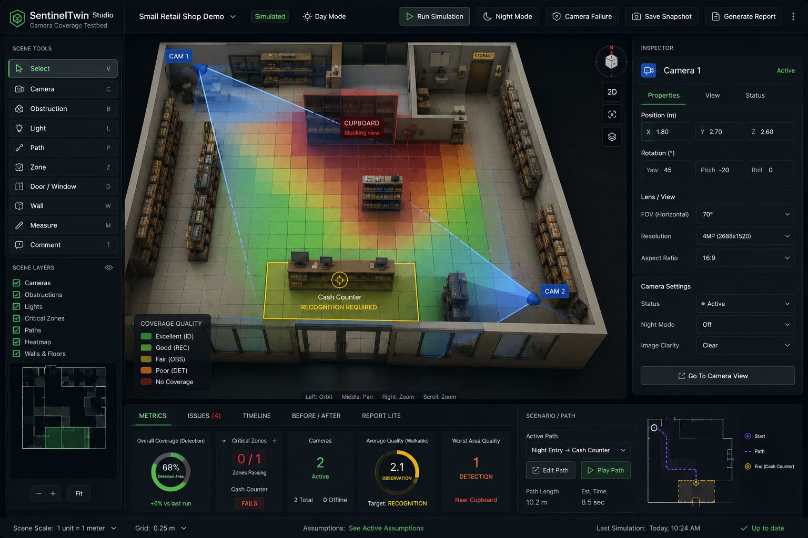

| Field | Value |
|---|---|
| Status | Reference / superseded by later full-suite coverage designs |
| Screen | SentinelTwin Studio |
| Workspace preset | Camera Coverage Testbed |
| Subscreen | Coverage Mode |
| Active tab/panel | Metrics |
| Selected component | Camera 1 Inspector |
| Dock state | Fixed left tools + right inspector + bottom metrics |
| Purpose | First correct direction: open directly into the camera testbed with Small Retail Shop loaded. |
| Save as | `CameraStudioWorkspace_MainCoverage_EarlyTarget.png` |
| Feel target | Operator workspace / security simulation studio. |

### What is correct in the image

- 3D shop scene is the hero.
- Camera cones, heatmap, critical zone, blocked cupboard, inspector, metrics, scenario path all visible.

### What feels wrong / avoid

- Panels are fully fixed and dense.
- Visual hierarchy still less refined than later images.

### What must stay / implementation contract

- Keep direct-to-studio concept.
- Keep Small Retail Shop as default V0.1 scene.

---

## 4. Full Camera Suite Coverage Mode — broad concept

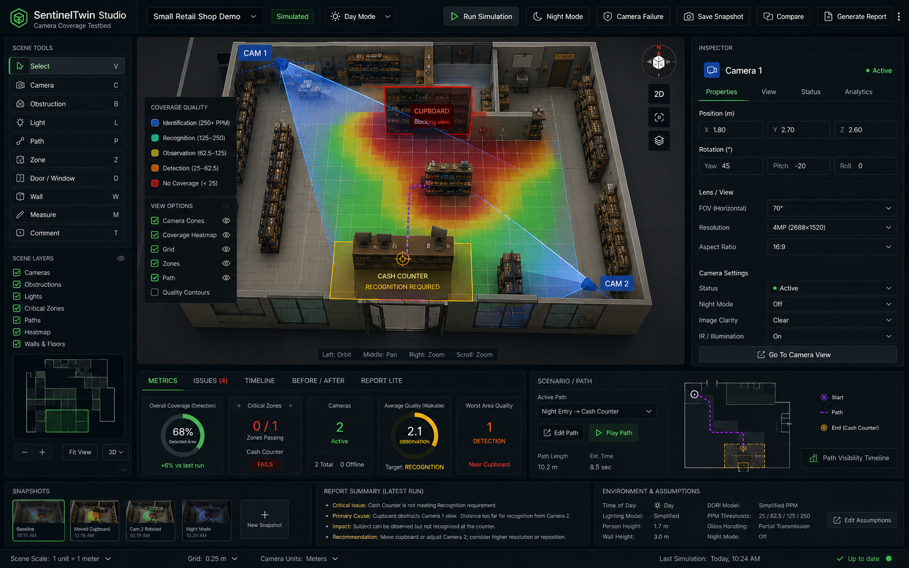

| Field | Value |
|---|---|
| Status | Reference / coverage mode target |
| Screen | SentinelTwin Studio |
| Workspace preset | Full Camera Suite |
| Subscreen | Coverage Mode |
| Active tab/panel | Metrics |
| Selected component | Camera 1 Inspector |
| Dock state | Left tools/layers/minimap + center canvas + right inspector + bottom analytics |
| Purpose | Expanded camera suite coverage mode with many controls and panels visible. |
| Save as | `FullCameraSuiteCoverageMode_metrics_Camera1Inspector_Concept.png` |
| Feel target | Professional security planning/CAD workspace. |

### What is correct in the image

- Includes DORI/PPM legend, view options, layers, minimap, snapshots, assumptions, report summary.
- Good coverage of full Camera Studio feature set.

### What feels wrong / avoid

- Too many panels open at once for default state.
- Should move toward collapsible docks and workspace presets.

### What must stay / implementation contract

- Coverage legend must use DORI/security outcome labels.
- Camera inspector stays object-specific.

---

## 5. Full Camera Suite Coverage Mode — final main coverage target

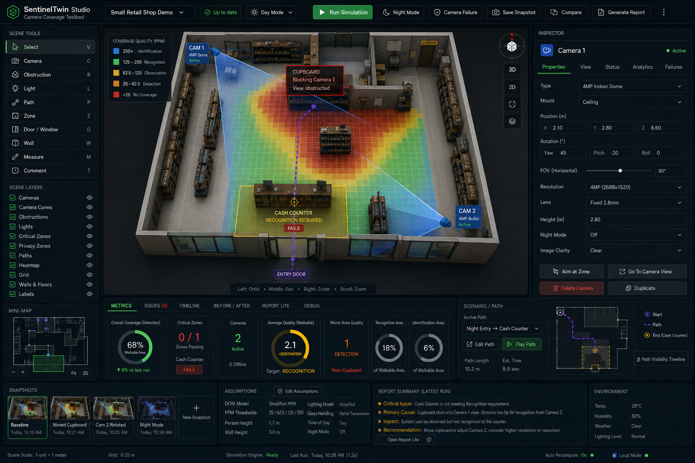

| Field | Value |
|---|---|
| Status | Primary target for Coverage Mode |
| Screen | SentinelTwin Studio |
| Workspace preset | Coverage Workspace |
| Subscreen | Coverage Mode |
| Active tab/panel | Metrics |
| Selected component | Camera 1 Inspector |
| Dock state | Left dock expanded, right inspector expanded, bottom insights expanded |
| Purpose | Primary V0.1 Camera Studio screen: coverage heatmap, DORI quality, camera cones, path, snapshots, assumptions, report summary. |
| Save as | `FullCameraSuiteCoverageMode_metrics_Camera1Inspector.png` |
| Feel target | Figma/Blender canvas with Adobe-style panels. |

### What is correct in the image

- Strong central 3D scene with heatmap, camera FOV, path, critical zone and obstruction warning.
- Top bar actions are operational: Run Simulation, Night Mode, Camera Failure, Save Snapshot, Compare, Generate Report.
- Metrics and report summary make the simulation explainable.

### What feels wrong / avoid

- Default app should support collapsing panels to avoid canvas crowding.
- Environment panel can be secondary.

### What must stay / implementation contract

- Keep DORI/PPM legend.
- Keep assumptions visible.
- Keep report summary tied to verified simulation.

---

## 6. Coverage Mode — cleaner V0.1 primary workspace

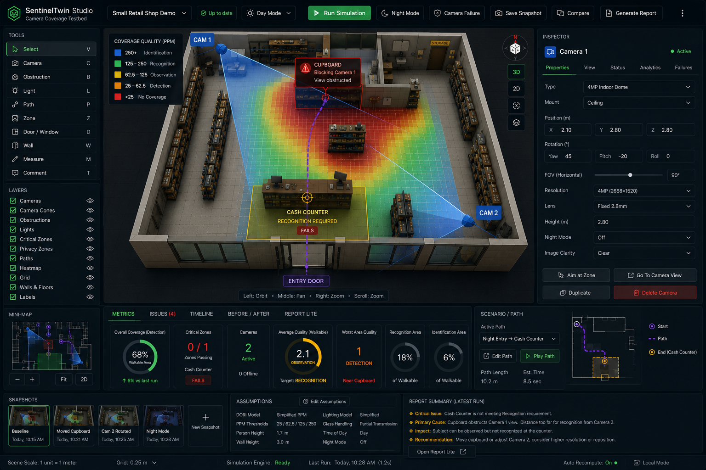

| Field | Value |
|---|---|
| Status | Primary target variant / cleaner coverage mode |
| Screen | SentinelTwin Studio |
| Workspace preset | Coverage Workspace |
| Subscreen | Coverage Mode |
| Active tab/panel | Metrics |
| Selected component | Camera 1 Inspector |
| Dock state | Left dock expanded, right inspector expanded, bottom metrics drawer |
| Purpose | Cleaner V0.1 first workspace focused on coverage, metrics, and camera editing. |
| Save as | `CoverageMode_Metrics_Camera1Inspector.png` |
| Feel target | Serious simulation workstation. |

### What is correct in the image

- Less clutter than broad full-suite concept.
- Cash counter failure and cupboard obstruction are obvious.
- Scenario/path and metrics are still visible.

### What feels wrong / avoid

- Can still feel fixed-panel-heavy.
- Needs collapsible dock behavior in real implementation.

### What must stay / implementation contract

- Use this as the clearest Coverage Mode visual target.

---

## 7. Camera View Mode

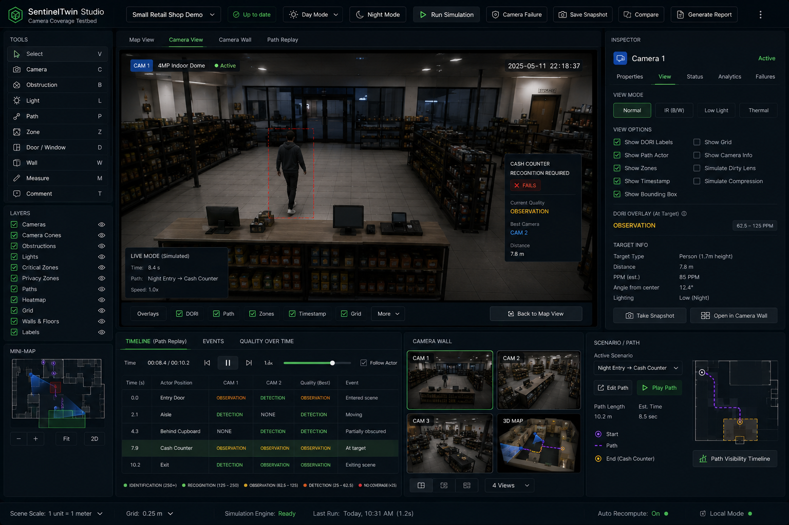

| Field | Value |
|---|---|
| Status | Primary target for Camera View polish |
| Screen | SentinelTwin Studio |
| Workspace preset | Camera View Workspace |
| Subscreen | Camera View Mode |
| Active tab/panel | Timeline / Path Replay |
| Selected component | Camera 1 Inspector — View tab |
| Dock state | Left tools/layers visible, right camera view inspector, bottom timeline/camera wall area |
| Purpose | Shows the simulated feed from a selected camera with DORI overlays, target info, and replay context. |
| Save as | `CameraViewMode_TimelinePathReplay_Camera1InspectorViewtab.png` |
| Feel target | CCTV operator monitor + simulation overlay. |

### What is correct in the image

- Large single-camera feed communicates what the camera actually sees.
- DORI target card, bounding box, timestamp, view toggles and timeline are right.
- Mini camera wall previews are helpful.

### What feels wrong / avoid

- The actual repo should make this full-canvas and less dependent on full side panels.
- DORI overlay should be current-time/target-aware, not only generic camera range.

### What must stay / implementation contract

- Keep Camera View distinct from inspector mini-feed.
- Keep Normal/IR/Low Light/Thermal modes.

---

## 8. Camera Wall Mode

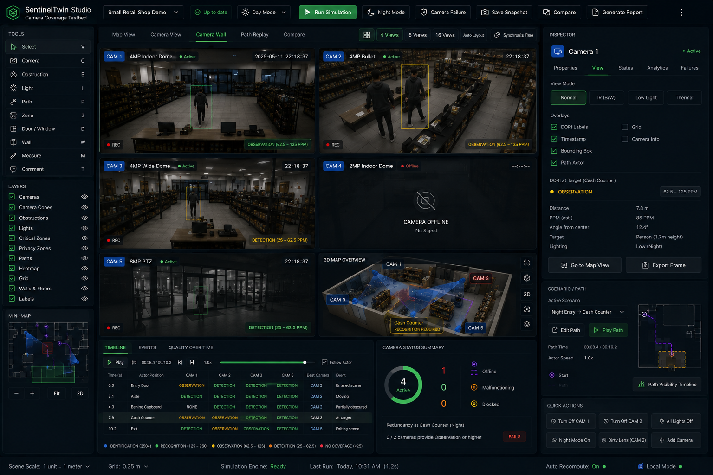

| Field | Value |
|---|---|
| Status | Primary target for Camera Wall polish |
| Screen | SentinelTwin Studio |
| Workspace preset | Camera Wall Workspace |
| Subscreen | Camera Wall Mode |
| Active tab/panel | Timeline / Camera Status Summary |
| Selected component | Camera 1 Inspector — View tab |
| Dock state | Feed-first layout; side/bottom panels optional/floating |
| Purpose | Shows multiple simulated camera feeds at once to identify which cameras see the actor and which fail. |
| Save as | `CameraWallMode_Timeline_Camera1InspectorViewTab.png` |
| Feel target | Security control room / OBS multiview. |

### What is correct in the image

- Multi-feed grid, offline tile, DORI badges, map overview, status summary and quick actions are the right feature set.

### What feels wrong / avoid

- Generated version has too many fixed panels. Real app should prioritize feed area and use floating summaries.

### What must stay / implementation contract

- Keep adaptive feed grid and offline/dirty/blocked states.
- Keep synchronized replay time across feeds.

---

## 9. Path Replay Mode

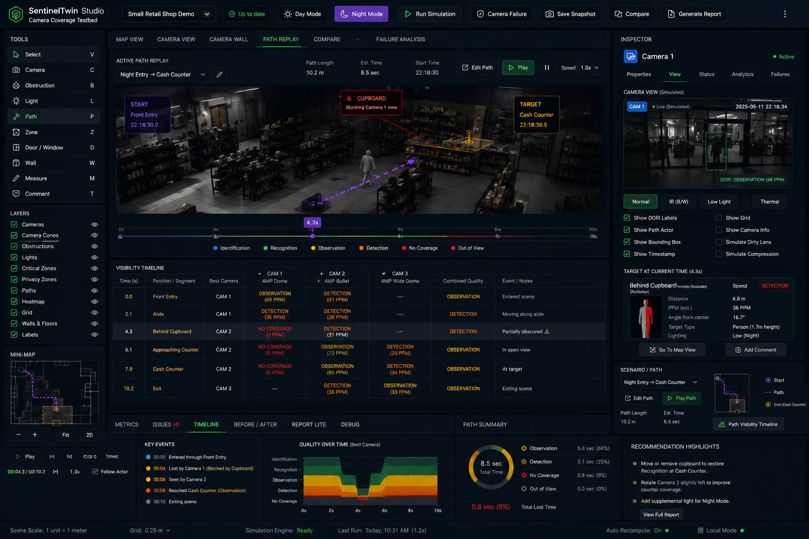

| Field | Value |
|---|---|
| Status | Primary target for Path Replay polish |
| Screen | SentinelTwin Studio |
| Workspace preset | Path Replay Workspace |
| Subscreen | Path Replay Mode |
| Active tab/panel | Timeline |
| Selected component | Camera 1 Inspector — View tab |
| Dock state | Replay-focused center, contextual right inspector, expanded timeline drawer |
| Purpose | Detailed route visibility analysis over time: actor path, lost/visible moments, per-camera quality, and recommendations. |
| Save as | `PathReplayMode_Timeline_Camera1Inspector.png` |
| Feel target | Adobe Premiere timeline + security incident analysis. |

### What is correct in the image

- Large replay viewport, actor, path, time scrubber, timeline table, quality chart and recommendations are right.

### What feels wrong / avoid

- Language must avoid evasion/bypass framing.
- Current-state annotations should be more prominent in implementation.

### What must stay / implementation contract

- Path Replay remains separate from ScenarioPathPanel.
- Use defensive incident/coverage replay language.

---

## 10. Compare / Before-After Mode

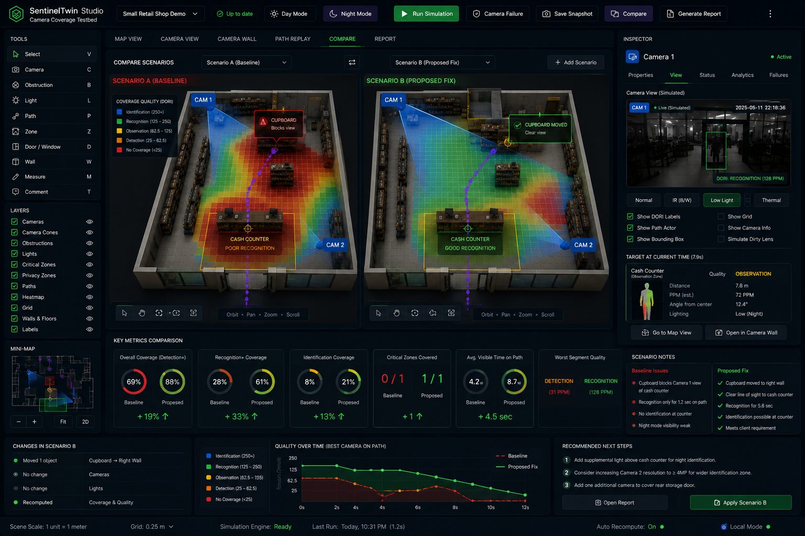

| Field | Value |
|---|---|
| Status | Primary target for Compare polish |
| Screen | SentinelTwin Studio |
| Workspace preset | Compare Workspace |
| Subscreen | Before / After Scenario Compare |
| Active tab/panel | Compare |
| Selected component | Camera 1 Inspector — View tab |
| Dock state | Side-by-side compare canvas, right inspector/status, bottom delta metrics |
| Purpose | Compares baseline vs proposed fix with verified coverage, recognition, critical-zone, and path deltas. |
| Save as | `CompareMode_BeforeAfter_Camera1InspectorViewTab.png` |
| Feel target | Figma version compare + audit evidence. |

### What is correct in the image

- Scenario A/B side-by-side is clear.
- Metric deltas and quality-over-time graph are right.
- Apply Scenario B is the right action.

### What feels wrong / avoid

- Needs explicit “what changed” list and source of proposed fix.
- Avoid magic: show verified simulation deltas.

### What must stay / implementation contract

- Keep baseline/proposed split.
- Keep delta metrics prominent.

---

## 11. MiniMap — initial design board

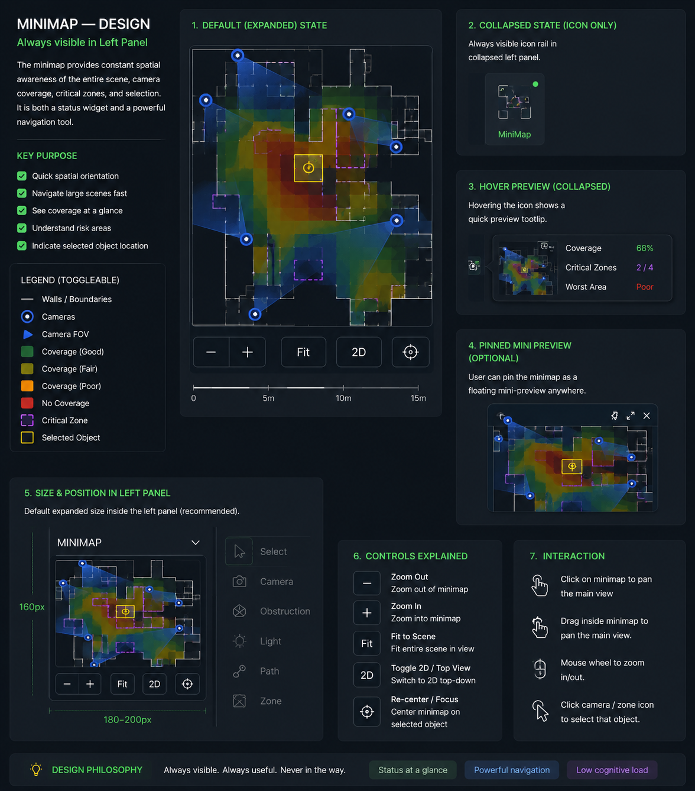

| Field | Value |
|---|---|
| Status | Reference / superseded by refined MiniMap board |
| Screen | SentinelTwin Component Design |
| Workspace preset | Left Panel / Dock System |
| Subscreen | MiniMap component states |
| Active tab/panel | Component Spec |
| Selected component | MiniMap |
| Dock state | Left dock compact/collapsed/expanded variants |
| Purpose | Explores MiniMap role, purpose, compact size, hover preview and pinned preview. |
| Save as | `MiniMapComponent_DesignBoard_InitialStates.png` |
| Feel target | Design-system explainer. |

### What is correct in the image

- MiniMap is framed as useful navigation, not passive status.
- Shows expected content: walls, FOV, heatmap, critical zone, selected object.

### What feels wrong / avoid

- Too presentation-like; refined board is cleaner for implementation.

### What must stay / implementation contract

- Keep answer: MiniMap is useful navigation map, not just tiny widget.

---

## 12. MiniMap — collapsed, compact, expanded states

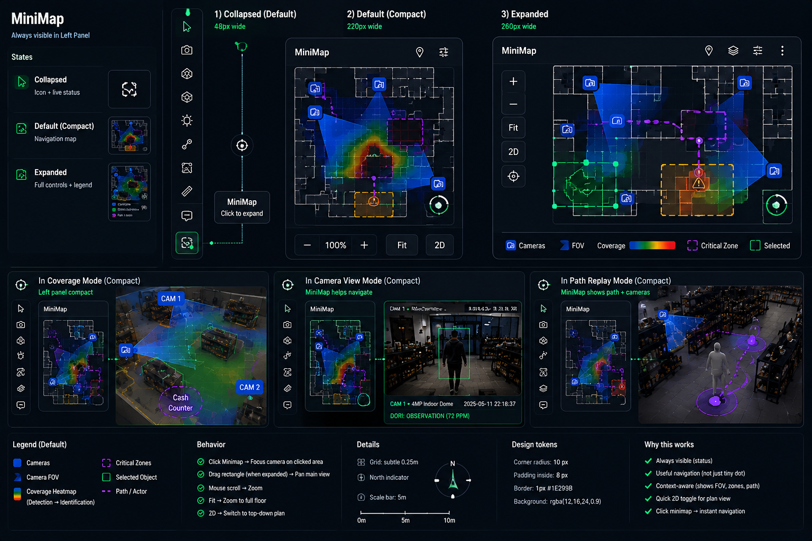

| Field | Value |
|---|---|
| Status | Primary MiniMap state reference |
| Screen | SentinelTwin Component Design |
| Workspace preset | Left Panel / Dock System |
| Subscreen | MiniMap Component States |
| Active tab/panel | Component Spec / MiniMap |
| Selected component | MiniMap — Collapsed, Compact, Expanded |
| Dock state | Left dock collapsed + compact + expanded variants |
| Purpose | Defines MiniMap states: icon rail, compact always-visible map, expanded navigation panel, and hover behavior. |
| Save as | `MiniMapComponent_States_CollapsedCompactExpanded.png` |
| Feel target | Figma navigator + GIS minimap. |

### What is correct in the image

- Clear sizing and state hierarchy.
- Shows compact MiniMap in Coverage, Camera View, and Path Replay contexts.
- Includes legend, behavior, details and design tokens.

### What feels wrong / avoid

- Implementation should not create multiple separate minimap components; use shared MapCanvas.

### What must stay / implementation contract

- Default compact when left dock expanded.
- Icon-only when dock collapsed.
- Expanded drawer for navigation/detail.

---

## 13. MiniMap — expanded / hover state

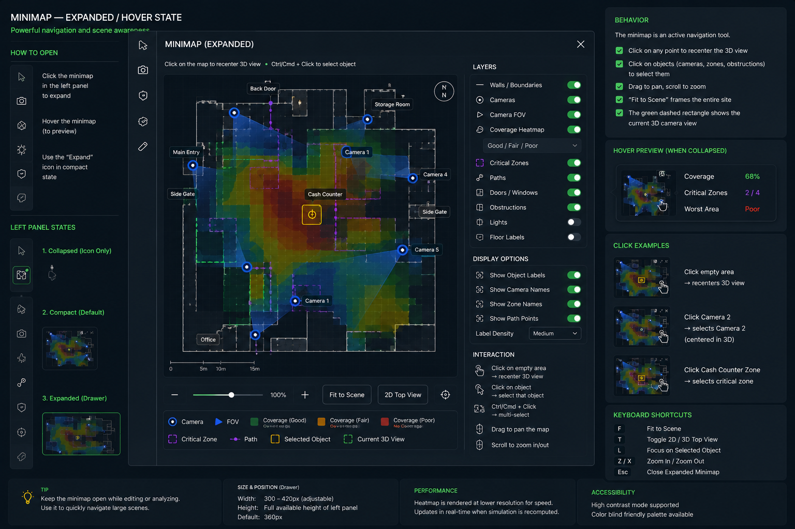

| Field | Value |
|---|---|
| Status | Primary expanded MiniMap reference |
| Screen | SentinelTwin Component Design |
| Workspace preset | Left Panel / Dock System |
| Subscreen | MiniMap Expanded / Hover State |
| Active tab/panel | Component Spec / MiniMap |
| Selected component | MiniMap — Expanded Drawer + Hover Preview |
| Dock state | Left dock supports collapsed icon, compact default, expanded drawer |
| Purpose | Defines expanded MiniMap as active navigation and selection tool. |
| Save as | `MiniMapComponent_ExpandedHoverState_DrawerNavigation.png` |
| Feel target | GIS navigation drawer. |

### What is correct in the image

- Layer toggles, object labels, fit, 2D top view, scale/north, behavior rules are right.
- Answers click behavior: empty map recenters, object click selects, ctrl/cmd multi-select.

### What feels wrong / avoid

- Should be drawer/panel, not modal by default.

### What must stay / implementation contract

- MiniMap is active navigation + selection tool.

---

## 14. PathMap — scenario/path panel state

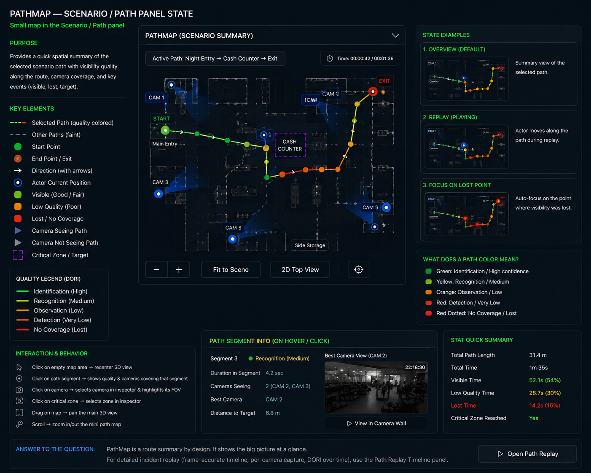

| Field | Value |
|---|---|
| Status | Primary PathMap summary reference |
| Screen | SentinelTwin Component Design |
| Workspace preset | Scenario / Path Panel |
| Subscreen | PathMap — Scenario Summary State |
| Active tab/panel | Component Spec / PathMap |
| Selected component | PathMap inside Scenario / Path Panel |
| Dock state | Compact right/bottom scenario panel map |
| Purpose | Defines PathMap as compact route summary showing selected path, quality, cameras, lost/visible points and target zone. |
| Save as | `PathMapComponent_ScenarioPathPanel_RouteSummaryState.png` |
| Feel target | GIS route summary card. |

### What is correct in the image

- Clearly distinguishes route summary from detailed replay.
- Selected path, other paths, start/end, arrows, current actor, camera visibility and critical zone are shown.

### What feels wrong / avoid

- Do not make this full replay; detailed replay belongs in PathReplayView.

### What must stay / implementation contract

- PathMap default = route summary.
- Open Path Replay for detailed analysis.

---

## 15. PathMap — replay state

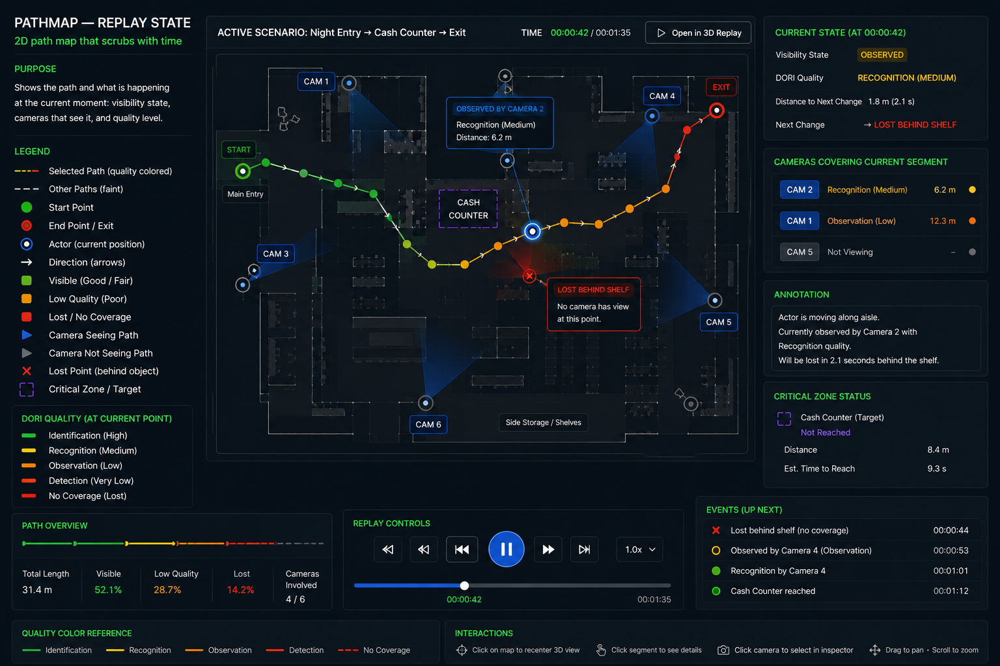

| Field | Value |
|---|---|
| Status | Primary PathMap replay reference |
| Screen | SentinelTwin Component Design |
| Workspace preset | Scenario / Path Panel + Replay System |
| Subscreen | PathMap — Replay State |
| Active tab/panel | Component Spec / PathMap Replay |
| Selected component | PathMap with live actor position + current visibility state |
| Dock state | Component spec board showing replay behavior |
| Purpose | Defines how PathMap scrubs with time during replay and shows current visibility/DORI/camera state. |
| Save as | `PathMapComponent_ReplayState_LiveActorVisibility.png` |
| Feel target | Live route-state map. |

### What is correct in the image

- Actor dot, time marker, current state card, camera badges, lost/visible annotation and upcoming events are right.

### What feels wrong / avoid

- Do not turn it into full PathReplayView; keep it compact and synchronized.

### What must stay / implementation contract

- At a glance: where actor is, visibility state, best camera, DORI quality, upcoming lost/zone event, cause.

---

## 16. Map Layer Visual Language

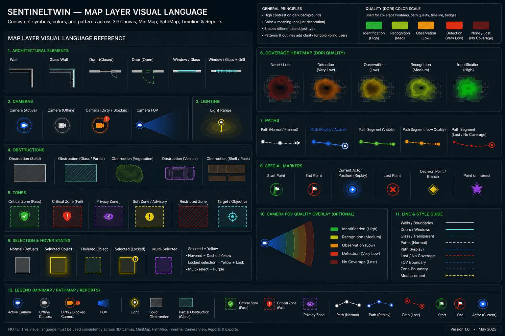

| Field | Value |
|---|---|
| Status | Critical design-system reference |
| Screen | SentinelTwin Design System |
| Workspace preset | Shared Visual Language / Design Board |
| Subscreen | Map Layer Visual Language |
| Active tab/panel | Design Spec / Layer Tokens |
| Selected component | Shared map/canvas/timeline/report symbols |
| Dock state | Standalone design board |
| Purpose | Canonical colors, symbols, fills, line styles and interaction states for all map/canvas/timeline/report surfaces. |
| Save as | `DesignSystem_MapLayerVisualLanguage_CanonicalTokens.png` |
| Feel target | Design-system token board. |

### What is correct in the image

- Covers architecture, cameras, lights, obstructions, zones, coverage, paths, markers, selection/hover, legend.
- Explicitly prevents color chaos across MiniMap, PathMap, Canvas, Timeline and Reports.

### What feels wrong / avoid

- Must be reconciled with current code tokens in map-colors.ts.

### What must stay / implementation contract

- Use consistent tokens everywhere.
- Do not invent per-component colors.

---

## 17. Map interaction states — first wireframe board

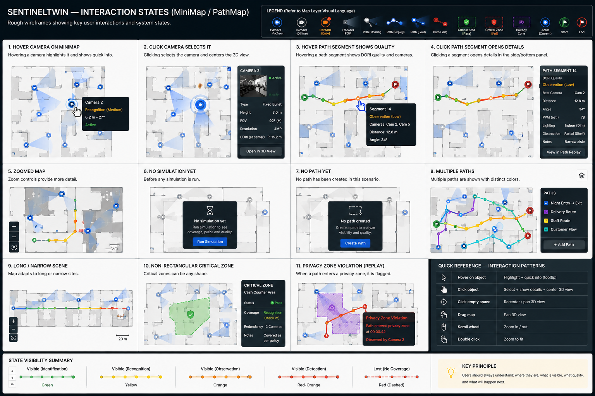

| Field | Value |
|---|---|
| Status | Reference / superseded by refined board |
| Screen | SentinelTwin Design System |
| Workspace preset | Interaction States / Wireframe Board |
| Subscreen | MiniMap + PathMap Interaction States |
| Active tab/panel | Design Spec / Interaction Patterns |
| Selected component | Map Interaction States |
| Dock state | Standalone design board |
| Purpose | Early state matrix for hover/click/zoom/empty/multipath/special geometry/privacy cases. |
| Save as | `DesignSystem_MapInteractionStates_MiniMapPathMapWireframes.png` |
| Feel target | Wireframe implementation checklist. |

### What is correct in the image

- Covers the right states and behaviors.
- Good reference for edge-state coverage.

### What feels wrong / avoid

- Light board style is less aligned with dark app than refined board.

### What must stay / implementation contract

- Retain the state list and interaction rules.

---

## 18. Map interaction states — refined board

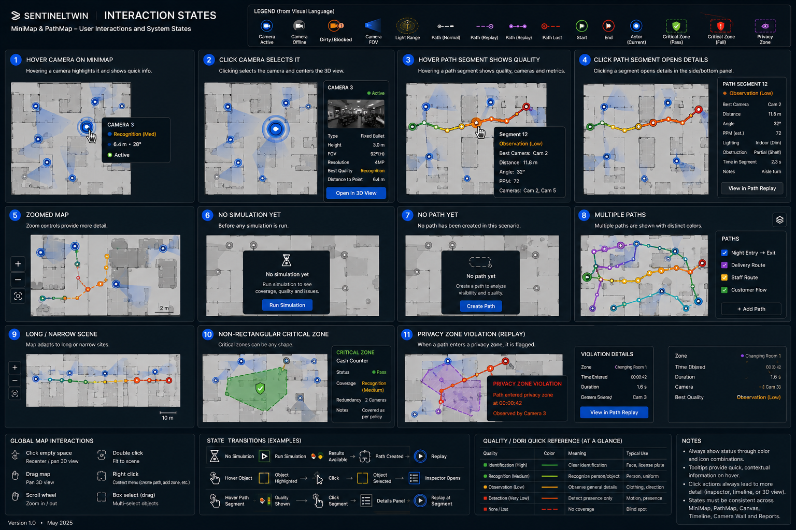

| Field | Value |
|---|---|
| Status | Primary interaction-state reference |
| Screen | SentinelTwin Design System |
| Workspace preset | Interaction States / Wireframe Board |
| Subscreen | MiniMap + PathMap Interaction States — Refined Board |
| Active tab/panel | Design Spec / Interaction Patterns |
| Selected component | Map Interaction State Matrix |
| Dock state | Standalone design board |
| Purpose | Defines global interaction behavior for MiniMap/PathMap hover, click, selection, zoom, missing-state, multi-path, geometry, privacy violation, and transitions. |
| Save as | `DesignSystem_MapInteractionStates_RefinedWireframeBoard.png` |
| Feel target | Design-system state matrix. |

### What is correct in the image

- Includes global interactions, state transitions, quick DORI reference and notes.
- Clear enough for implementation handoff.

### What feels wrong / avoid

- Keep as reference; do not implement as one actual screen.

### What must stay / implementation contract

- Hover previews, click selects/details, empty-space recenters, drag pans, scroll zooms, double-click fits.

---

## 19. Studio Dashboard Home — current workspace preview

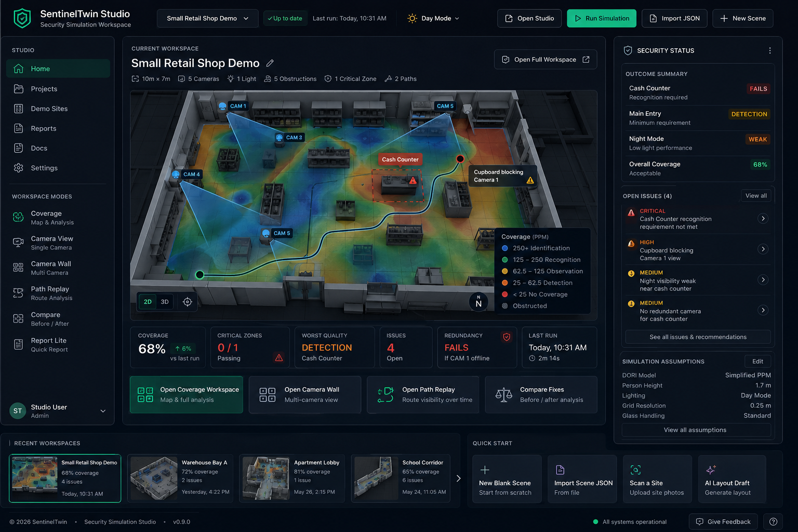

| Field | Value |
|---|---|
| Status | Immediate root replacement target |
| Screen | SentinelTwin Studio |
| Workspace preset | Studio Dashboard Home |
| Subscreen | Current Workspace Overview |
| Active tab/panel | Current Workspace Preview + Security Status |
| Selected component | Small Retail Shop Demo |
| Dock state | Dashboard layout: left nav, central preview, right risk panel, bottom recent/quick-start dock |
| Purpose | Replaces the form-like root page with a studio dashboard focused on the currently loaded workspace. |
| Save as | `StudioDashboardHome_CurrentWorkspacePreview_RiskStatusPanel.png` |
| Feel target | Figma file browser + Blender splash + security command center. |

### What is correct in the image

- Large scene preview makes root feel like product.
- Right risk/status panel is security-first.
- Primary actions open Coverage, Camera Wall, Path Replay, Compare.
- Creation/import/scan/AI draft are secondary.

### What feels wrong / avoid

- Avoid making it platform-wide too early. This is module-level Studio Home.

### What must stay / implementation contract

- Use as immediate replacement for current centered form root.

---

## 20. Platform Home — command center for full product

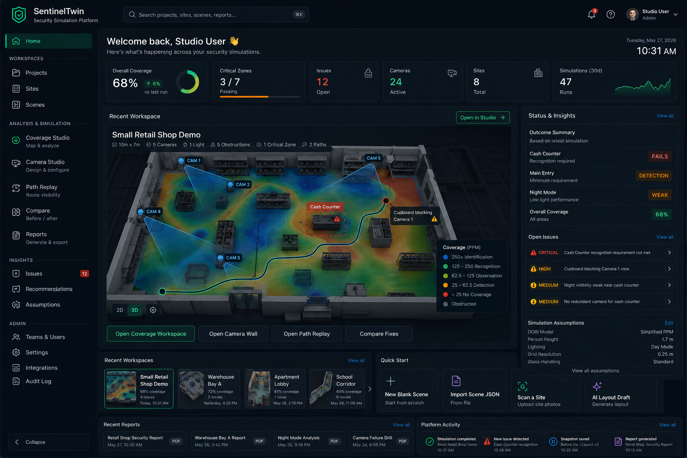

| Field | Value |
|---|---|
| Status | Future full-app root concept |
| Screen | SentinelTwin |
| Workspace preset | Platform Home / Security Command Center |
| Subscreen | Portfolio Overview + Recent Workspace |
| Active tab/panel | Recent Workspace Preview + Status & Insights |
| Selected component | Small Retail Shop Demo |
| Dock state | Platform-wide left nav, portfolio KPI row, recent workspace preview, insights panel, bottom recent/reports/activity |
| Purpose | Full finished-product homepage across projects, sites, scenes, reports, issues, recommendations and activity. |
| Save as | `PlatformHome_CommandCenter_RecentWorkspaceRiskOverview.png` |
| Feel target | Security simulation command center / portfolio dashboard. |

### What is correct in the image

- Shows broader app scope beyond Camera Studio.
- Portfolio KPIs, projects/sites/reports, platform activity and recent reports are correct for V1+.

### What feels wrong / avoid

- Too similar to StudioDashboardHome unless labels/scope are clearly separated. Not immediate root for current repo if product is still Studio-first.

### What must stay / implementation contract

- Use later when multi-site/project/report management exists.

---

## 21. Current repo root launcher — problem reference

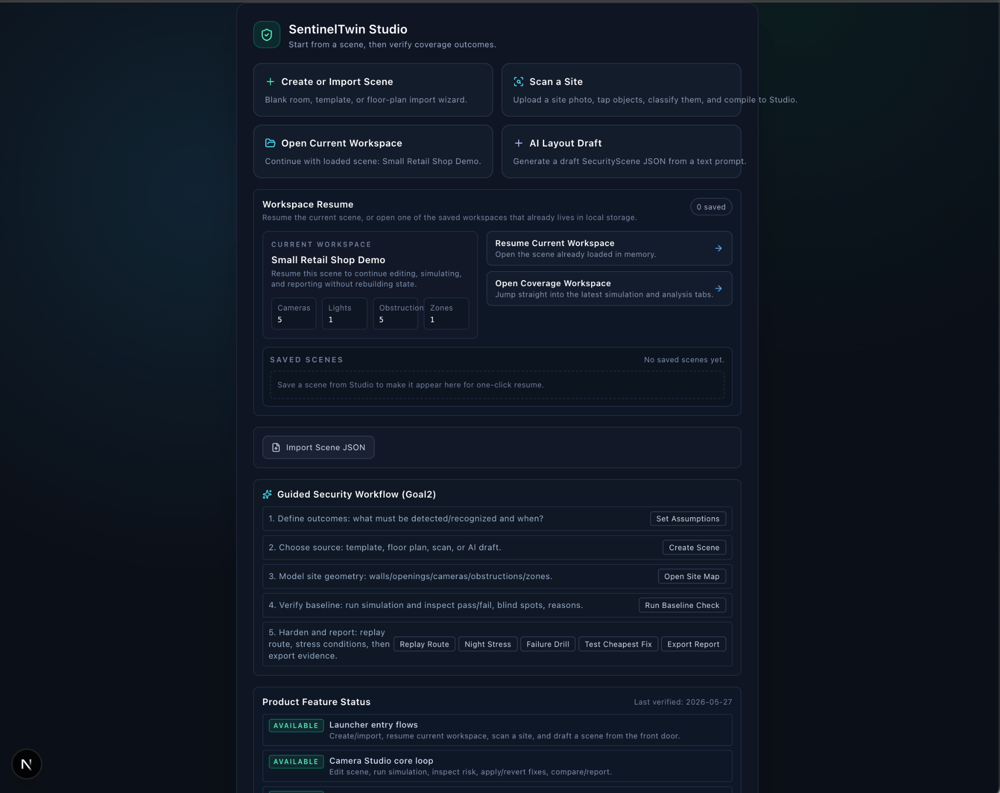

| Field | Value |
|---|---|
| Status | Current problem / replace |
| Screen | SentinelTwin Studio root page |
| Workspace preset | Current implementation |
| Subscreen | Form-like launcher |
| Active tab/panel | Workspace Resume |
| Selected component | Create/Import, Scan, Open, AI Draft cards |
| Dock state | Centered max-width card with stacked sections |
| Purpose | Screenshot of current root page that looks like a form/checklist instead of a studio dashboard. |
| Save as | `CurrentRepoRootLauncher_FormProblem.png` |
| Feel target | Negative reference. Replace with StudioDashboardHome. |

### What is correct in the image

- Flows exist: create/import, scan, open current, AI layout, import JSON, saved scenes.
- Functionality should be preserved.

### What feels wrong / avoid

- Centered form card.
- Too much checklist/product-status content.
- No large scene preview or command-center feel.
- All actions look like setup steps rather than studio operations.

### What must stay / implementation contract

- Do not delete working flows; reframe them as dashboard actions.

---

# Repo mapping notes

Use these existing repo component names when mapping screens to implementation:

```txt
StudioShell
TopBar
ViewModeBar
WorkspaceCanvas
DockLayout
DockPanel
DockRail
LeftPanel
SceneTools
SceneLayers
MiniMap
ContextRightPanel
InspectorPanel
AssumptionsPanel
ScenarioPathPanel
BottomPanel
CameraViewMode
CameraWallView
PathReplayView
CompareMode / CompareView
CoverageLegend
CommandBar
MapCanvas
MapLayers
PathMap
```

## Screen/component mapping

| Design ref | Likely repo files/components | Notes |
|---|---|---|
| `StudioDashboardHome_CurrentWorkspacePreview_RiskStatusPanel.png` | `apps/studio/src/app/page.tsx` | Immediate root replacement target. Preserve current wizard/import/AI flows but restructure as dashboard. |
| `CoverageMode_Metrics_Camera1Inspector.png` | `StudioShell`, `WorkspaceCanvas`, `LeftPanel`, `InspectorPanel`, `BottomPanel`, `ScenarioPathPanel` | Primary Camera Studio coverage workspace. |
| `CameraViewMode_TimelinePathReplay_Camera1InspectorViewtab.png` | `CameraViewMode`, `CameraFeedCanvas`, `InspectorPanel`, `TimelineTab` | Needs current-time/actor-aware DORI overlay polish. |
| `CameraWallMode_Timeline_Camera1InspectorViewTab.png` | `CameraWallView`, `CameraFeedCanvas`, `CameraStatusSummaryPanel` | Feed-first full-canvas mode; use floating summaries. |
| `PathReplayMode_Timeline_Camera1Inspector.png` | `PathReplayView`, `TimelineTab`, `PathMap`, `CameraFeedCanvas` | Detailed route visibility analysis. |
| `CompareMode_BeforeAfter_Camera1InspectorViewTab.png` | `CompareView`, `BeforeAfterTab`, `MetricsTab` | Baseline vs proposed fix with verified deltas. |
| `MiniMapComponent_States_CollapsedCompactExpanded.png` | `MiniMap`, `MapCanvas`, `MapLayers`, store map state | Default compact + collapsed + expanded states. |
| `MiniMapComponent_ExpandedHoverState_DrawerNavigation.png` | `MiniMap`, `MapCanvas`, `MapLayers` | Expanded drawer / hover preview / layer controls. |
| `PathMapComponent_ScenarioPathPanel_RouteSummaryState.png` | `ScenarioPathPanel`, `PathMap`, `MapCanvas`, `MapLayers` | Route summary, not full replay. |
| `PathMapComponent_ReplayState_LiveActorVisibility.png` | `PathMap`, `TimelineTab`, path replay store | Live actor position and current visibility state. |
| `DesignSystem_MapLayerVisualLanguage_CanonicalTokens.png` | `map-colors.ts`, `MapLayers.tsx`, `CoverageLegend`, Timeline badges, reports | Should become canonical token/design doc. |
| `DesignSystem_MapInteractionStates_RefinedWireframeBoard.png` | `MapCanvas`, `MapLayers`, `MiniMap`, `PathMap` | Hover/click/zoom/empty/multipath/privacy state matrix. |
| `PlatformHome_CommandCenter_RecentWorkspaceRiskOverview.png` | Future platform home, not immediate Studio root | Use when project/site/report portfolio exists. |
| `CurrentRepoRootLauncher_FormProblem.png` | `apps/studio/src/app/page.tsx` current problem | Negative reference: current root looks like a form. |

## Naming convention for future images

Use this pattern unless a specific save-as name is provided:

```txt
<ModeOrScreen>_<ActiveTabOrPanel>_<SelectedComponentOrFocus>.png
```

Examples:

```txt
CoverageMode_Metrics_Camera1Inspector.png
CameraViewMode_TimelinePathReplay_Camera1InspectorViewtab.png
PathReplayMode_Timeline_Camera1Inspector.png
CompareMode_BeforeAfter_Camera1InspectorViewTab.png
```
## 22. Site Intake Hub — Create Site Twin Source Selection

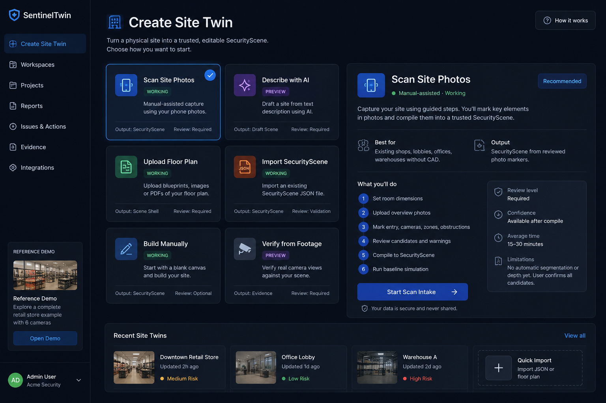

| Field | Value |
|---|---|
| Status | Primary target for Area 1 / Site Intake |
| Screen | SentinelTwin |
| Workspace preset | Site Intake / Create Site Twin |
| Subscreen | Source Selection |
| Active tab/panel | Scan Site Photos selected |
| Selected component | SiteIntakeHub |
| Dock state | Product left nav + source card grid + selected source detail panel + recent site twins |
| Purpose | First full-product entry screen for turning a real physical site into a trusted editable SecurityScene. |
| Save as | `SiteIntakeHub_CreateSiteTwin_SourceSelection.png` |
| Feel target | Security command-center intake screen; serious, operational, not marketing SaaS. |

### What is correct in the image

- Site creation is primary, not Studio/demo.
- All input sources are treated as native product paths.
- Scan Site Photos is selected and recommended, matching the no-CAD real-world wedge.
- Each source card states status, output, and review requirement.
- The right panel explains selected source workflow, limitations, and CTA.
- Recent site twins and reference demo are available but secondary.
- Visual style matches the existing dark command-center / Studio language.

### What feels wrong / avoid

- Do not make this a generic marketing homepage.
- Do not turn it into a plain centered form/checklist.
- Do not overstate scan automation; manual-assisted status must remain visible.
- Do not let Reference Demo dominate the page.

### What must stay / implementation contract

- Every source path must compile or hand off toward a canonical `SecurityScene`.
- Every source path must show review/warnings/provenance before replacing the workspace.
- Scan Site Photos remains the default recommended source.
- Demo stays available as reference only.

Suggested filename:

```text
ScanSiteWizard_GuidedCapture_RoomDimensionsOverviewPhotos.png
```

This follows the same convention:

```text
<ScreenOrComponent>_<StateOrMode>_<SpecificFocus>.png
```

It fits after the first design:

```text
SiteIntakeHub_CreateSiteTwin_SourceSelection.png
ScanSiteWizard_GuidedCapture_RoomDimensionsOverviewPhotos.png
```

---

# Image / screen details

## Screen

**Scan Site Photos — Guided Capture**

## Component / area

```text
ScanSiteWizard
```

or more specifically:

```text
GuidedScanCaptureFlow
```

This is the second screen in Area 1:

```text
Site Intake & Scene Creation
```

It appears after the user selects **Scan Site Photos** from the `SiteIntakeHub`.

## Status

**Primary target for Scan Site Photos V1**

This should be added to the design pack as a new primary target for the manual-assisted scan intake flow.

## Proposed save-as filename

```text
ScanSiteWizard_GuidedCapture_RoomDimensionsOverviewPhotos.png
```

## Purpose

This screen turns “scan site photos” from a loose upload/marking utility into a structured product flow.

The user is guided through site capture in ten steps:

1. Room Dimensions
2. Overview Photos
3. Front Wall / Room Shell
4. Entry Point
5. Critical Zone
6. Cameras
7. Obstructions
8. Lights & Windows
9. Path
10. Review & Compile

The screen makes the capture process feel deliberate, trustworthy, and operational.

---

# What the image covers

## 1. Product left navigation

The left rail remains consistent with the previous `SiteIntakeHub` design.

### Items shown

```text
Create Site Twin
Workspaces
Projects
Reports
Issues & Actions
Evidence
Integrations
Settings
```

`Create Site Twin` remains active.

### Why it matters

This keeps the scan flow inside the broader product, not as a separate modal or disconnected wizard.

---

## 2. Breadcrumb

Top-left of the main area:

```text
Create Site Twin > Scan Site Photos
```

### Why it matters

The user knows they came from the first product area and is now inside the selected source mode.

---

## 3. Header

```text
Scan Site Photos
Manual-assisted · Working
```

Subtitle:

```text
Capture your site using guided steps. Mark key elements in your photos and compile them into a trusted SecurityScene.
```

### Why it matters

The status remains honest. It does not claim automatic AI reconstruction.

---

## 4. Top-right actions

```text
Save & Exit
Next: Mark Entry
How it works
```

### Why it matters

This flow may take time in a real site. The user needs a save/exit affordance.

`Next: Mark Entry` shows forward progress.

---

# Stepper design

The screen has a horizontal 10-step progress stepper:

```text
1. Room Dimensions
2. Overview Photos
3. Front Wall (Shell)
4. Entry Point
5. Critical Zone
6. Cameras
7. Obstructions
8. Lights & Windows
9. Path
10. Review & Compile
```

## Current state

Step 1 is active.

The main panel is titled:

```text
Step 1 of 10: Set Room Dimensions
```

Even though overview photos are visible in the same screen, the screen combines room dimensions and overview upload to keep the first step productive.

## Design note

For implementation, this can be either:

* Step 1: dimensions only, then Step 2: upload photos, or
* combined Step 1 screen with dimensions left and overview photos right.

The mockup chooses the second because it feels faster and less form-like.

---

# Main content layout

The main card is split into two sections:

```text
Left: Room dimensions
Right: Upload overview photos
```

## Left panel — room dimensions

Fields:

```text
Length (X): 12.0 m
Width (Y): 8.0 m
Ceiling Height (Z): 3.0 m
```

Helper note:

```text
These values can be adjusted later. Accuracy here improves results.
```

### Why it matters

This gives the manual-assisted scan a basic scale reference before object marking.

It also avoids overclaiming depth estimation.

---

## Right panel — upload overview photos

Title:

```text
Upload Overview Photos
```

Instructions:

```text
Add 3–6 photos from different corners or sides.
Include walls, entry, ceiling and layout context.
```

The design shows:

* 3 uploaded photo thumbnails,
* 3 empty upload slots,
* numbered photo badges,
* remove buttons on each thumbnail.

Tips:

```text
Take photos from all four corners.
Include ceiling and floor in at least one shot.
Avoid zoom. Use wide-angle if possible.
```

Example coverage diagram:

* small plan preview,
* camera/photo positions at corners,
* arrows showing coverage direction.

### Why it matters

This is the first actual capture-quality coaching. It teaches the user what kind of photos are useful.

---

# Right progress panel

The right sidebar shows:

## Progress

```text
Your progress
1 of 10 steps completed
```

Progress bar.

## Steps overview

List:

```text
1. Set room dimensions
2. Upload overview photos
3. Mark front wall / room shell
4. Mark entry point
5. Mark critical zone
6. Mark existing cameras
7. Mark obstructions
8. Mark lights & windows
9. Mark path
10. Review & compile
```

Current step is highlighted.

## Session info

```text
Session ID: SCAN-2025-05-26-001
Created: May 26, 2025 · 10:24 AM
Photos uploaded: 3
Est. time remaining: 15–25 min
```

## Limitation card

```text
Manual-assisted scan (V1)
You confirm all elements.
AI segmentation & depth coming later.
```

### Why it matters

This is the honest product status system applied at the point of use.

---

# Bottom action bar

The bottom bar contains:

```text
There is no perfect photo. More context helps us help you.
```

Actions:

```text
Back
Next: Mark Entry
```

### Why it matters

This keeps the user moving and reduces anxiety about capture quality.

---

# Layout summary

```text
┌──────────────────┬────────────────────────────────────────────────────┐
│ Product nav       │ Breadcrumb + Header + Actions                      │
│                  ├────────────────────────────────────────────────────┤
│ Create Site Twin  │ Horizontal 10-step progress stepper                │
│ Workspaces        ├───────────────────────────────┬────────────────────┤
│ Projects          │ Main content card              │ Progress sidebar   │
│ Reports           │                               │                    │
│ Evidence          │ Left: dimensions               │ Your progress      │
│ Integrations      │ Right: overview photos         │ Steps overview     │
│ Settings          │ Tips + example coverage        │ Session info       │
│                  ├───────────────────────────────┴────────────────────┤
│ Reference demo    │ Bottom helper + Back / Next CTA                    │
└──────────────────┴────────────────────────────────────────────────────┘
```

---

# Design language

## Style

Dark, professional, operational, product-grade.

## Visual continuity

This screen directly continues from:

```text
SiteIntakeHub_CreateSiteTwin_SourceSelection.png
```

It preserves:

* left product nav,
* dark command-center theme,
* blue active state,
* green Working badge,
* card-based layout,
* serious security product tone.

## Existing design references

This should align with:

* `StudioDashboardHome_CurrentWorkspacePreview_RiskStatusPanel.png`
* `PlatformHome_CommandCenter_RecentWorkspaceRiskOverview.png`
* `DesignSystem_MapLayerVisualLanguage_CanonicalTokens.png`
* `CurrentRepoRootLauncher_FormProblem.png` as a negative reference.

The design should avoid generic SaaS onboarding and avoid the old centered form/checklist problem.

---

# Implementation mapping

## Existing component to evolve

```text
apps/studio/src/components/scan-to-scene/ScanSiteWizard.tsx
```

## Suggested component extraction

```text
apps/studio/src/components/site-intake/ScanSiteWizardFrame.tsx
apps/studio/src/components/site-intake/ScanProgressStepper.tsx
apps/studio/src/components/site-intake/RoomDimensionsPanel.tsx
apps/studio/src/components/site-intake/OverviewPhotoUploader.tsx
apps/studio/src/components/site-intake/ScanProgressSidebar.tsx
apps/studio/src/components/site-intake/ScanCaptureTips.tsx
```

Do not rebuild everything. Existing `ScanSiteWizard` logic can remain; this design mainly changes layout and hierarchy.

---

# Suggested state model

```ts
type ScanSiteStep =
  | "room_dimensions"
  | "overview_photos"
  | "front_wall_shell"
  | "entry_point"
  | "critical_zone"
  | "cameras"
  | "obstructions"
  | "lights_windows"
  | "path"
  | "review_compile";

type ScanSessionProgress = {
  currentStep: ScanSiteStep;
  completedSteps: ScanSiteStep[];
  photosUploaded: number;
  estimatedTimeRemainingLabel: string;
};
```

---

# Copy spec

## Header

```text
Scan Site Photos
Manual-assisted · Working

Capture your site using guided steps. Mark key elements in your photos and compile them into a trusted SecurityScene.
```

## Stepper labels

```text
Room Dimensions
Overview Photos
Front Wall (Shell)
Entry Point
Critical Zone
Cameras
Obstructions
Lights & Windows
Path
Review & Compile
```

## Main panel title

```text
Step 1 of 10: Set Room Dimensions
```

## Room dimension helper

```text
Provide approximate room dimensions to help scale your photos accurately.
```

## Upload helper

```text
Add 3–6 photos from different corners or sides.
Include walls, entry, ceiling and layout context.
```

## Tips

```text
Take photos from all four corners.
Include ceiling and floor in at least one shot.
Avoid zoom. Use wide-angle if possible.
```

## Limitation card

```text
Manual-assisted scan (V1)
You confirm all elements.
AI segmentation & depth coming later.
```

## Bottom helper

```text
There is no perfect photo. More context helps us help you.
```

---

# What is correct in the image

* Scan is now a structured guided flow, not a loose upload modal.
* Manual-assisted status is visible.
* The user sees all 10 steps upfront.
* Room dimensions and overview photos are gathered early.
* Upload guidance teaches what photos to capture.
* Progress sidebar makes the workflow feel professional.
* Limitations are honest.
* Reference demo remains available but secondary.
* The screen maintains visual continuity with `SiteIntakeHub`.

---

# What feels wrong / avoid

* Do not turn the right progress panel into a generic onboarding checklist with no actual state.
* Do not claim AI segmentation/depth is available.
* Do not make Save & Exit fake; it should persist the scan session or be hidden until persistence exists.
* Do not make the 10-step flow rigid if the user already has photos/candidates.
* Do not make the user enter exact dimensions before allowing approximate capture.
* Do not overcomplicate the first step with calibration tools.

---

# Must stay / implementation contract

* Scan remains manual-assisted until real segmentation/depth exists.
* Every scan session eventually compiles to canonical `SecurityScene`.
* Every marked object must be reviewable before compile.
* The user must see warnings before handoff.
* The scan session must preserve source/provenance metadata.
* The flow must support save/resume if Save & Exit is shown.
* Step status must be derived from actual scan session state, not hardcoded UI.

---

# Design pack entry to add

```md
## 23. Scan Site Wizard — Guided Capture / Room Dimensions + Overview Photos

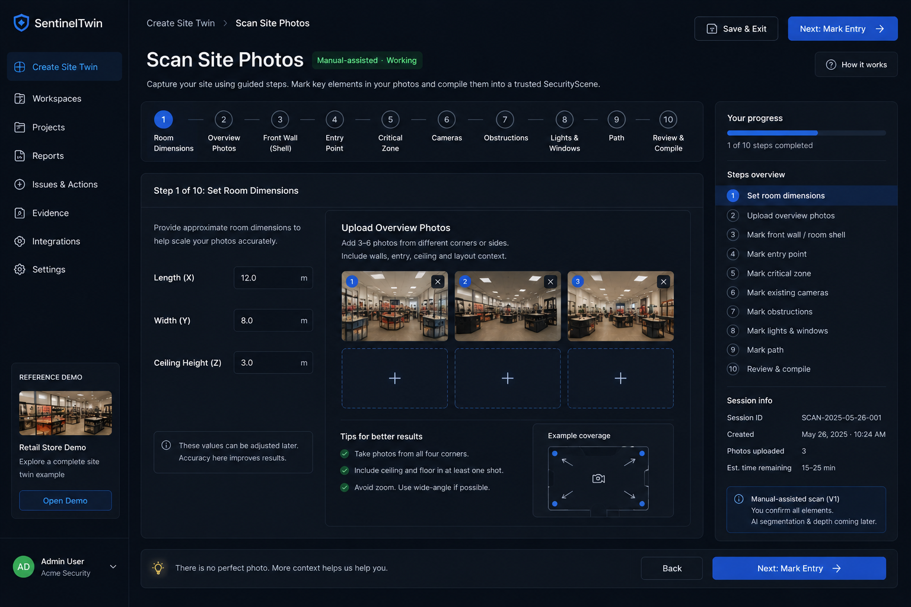

| Field | Value |
|---|---|
| Status | Primary target for Scan Site Photos V1 |
| Screen | SentinelTwin |
| Workspace preset | Site Intake / Scan Site Photos |
| Subscreen | Guided Capture — Room Dimensions + Overview Photos |
| Active tab/panel | Step 1 of 10 |
| Selected component | ScanSiteWizard / GuidedScanCaptureFlow |
| Dock state | Product left nav + top stepper + main capture card + progress sidebar |
| Purpose | Guides the user through manual-assisted site photo capture before compiling to a canonical SecurityScene. |
| Save as | `ScanSiteWizard_GuidedCapture_RoomDimensionsOverviewPhotos.png` |
| Feel target | Operational capture workflow; field-audit tool, not generic onboarding form. |

### What is correct in the image

- Scan flow is structured into clear steps.
- Manual-assisted status is prominent and honest.
- Room dimensions and overview photos are gathered early.
- Photo upload guidance improves capture quality.
- Progress sidebar shows current step, session info, and limitations.
- CTA moves user toward the next concrete marking task.
- Reference demo is available but secondary.

### What feels wrong / avoid

- Do not overclaim AI reconstruction.
- Do not create fake Save & Exit behavior without persistence.
- Do not turn this into a static checklist; progress must reflect real scan session state.
- Do not force exact dimensions before capture; approximate values should be allowed.

### What must stay / implementation contract

- Every scan session compiles into a canonical `SecurityScene`.
- Every user-marked candidate must remain reviewable before compile.
- Scan warnings and provenance must be visible before handoff.
- The flow must support source confidence and manual correction history.
```

This is the next component/screen after the Site Intake Hub.

## 22. Site Intake Hub — Create Site Twin Source Selection


| Field | Value |
|---|---|
| Status | Primary target for Area 1 / Site Intake |
| Screen | SentinelTwin |
| Workspace preset | Site Intake / Create Site Twin |
| Subscreen | Source Selection |
| Active tab/panel | Scan Site Photos selected |
| Selected component | SiteIntakeHub |
| Dock state | Product left nav + source card grid + selected source detail panel + recent site twins |
| Purpose | First full-product entry screen for turning a real physical site into a trusted editable SecurityScene. |
| Save as | `SiteIntakeHub_CreateSiteTwin_SourceSelection.png` |
| Feel target | Security command-center intake screen; serious, operational, not marketing SaaS. |

### What is correct in the image

- Site creation is primary, not Studio/demo.
- All input sources are treated as native product paths.
- Scan Site Photos is selected and recommended, matching the no-CAD real-world wedge.
- Each source card states status, output, and review requirement.
- The right panel explains selected source workflow, limitations, and CTA.
- Recent site twins and reference demo are available but secondary.
- Visual style matches the existing dark command-center / Studio language.

### What feels wrong / avoid

- Do not make this a generic marketing homepage.
- Do not turn it into a plain centered form/checklist.
- Do not overstate scan automation; manual-assisted status must remain visible.
- Do not let Reference Demo dominate the page.

### What must stay / implementation contract

- Every source path must compile or hand off toward a canonical `SecurityScene`.
- Every source path must show review/warnings/provenance before replacing the workspace.
- Scan Site Photos remains the default recommended source.
- Demo stays available as reference only.

---
